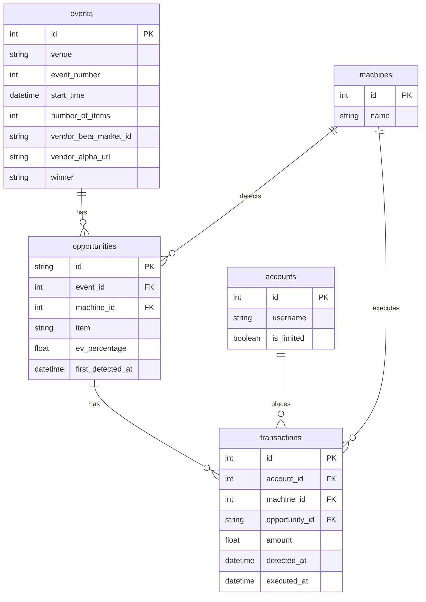

```mermaid
erDiagram

events ||--o{ opportunities : has
opportunities ||--o{ transactions : has
accounts ||--o{ transactions : places
machines ||--o{ transactions : executes
machines ||--o{ opportunities : detects

events {
    int id PK
    string venue
    int event_number
    datetime start_time
    int number_of_items
    string vendor_beta_market_id
    string vendor_alpha_url
    string winner
}

opportunities {
    string id PK
    int event_id FK
    int machine_id FK
    string item
    float ev_percentage
    datetime first_detected_at
}

transactions {
    int id PK
    int account_id FK
    int machine_id FK
    string opportunity_id FK
    float amount
    datetime detected_at
    datetime executed_at
}

accounts {
    int id PK
    string username
    boolean is_limited
}

machines {
    int id PK
    string name
}
```
